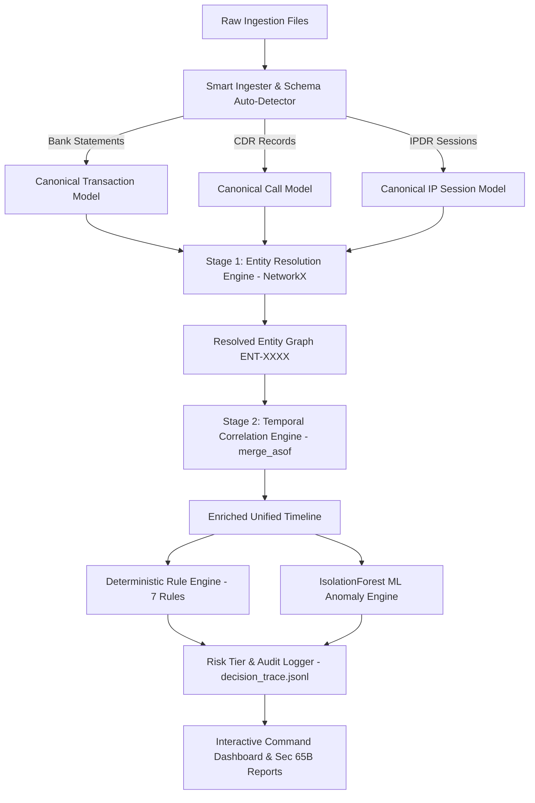

# 🏰 TOWER-1 (E-RAKSHAK)

> **AI-Powered Financial & Telecom Dataset Analyzer**  
> *Cross-Dataset Fusion & Anomaly Engine for Bank Statements, CDR, and IPDR Logs*

[](https://www.python.org/)
[](https://fastapi.tiangolo.com/)
[](LICENSE)
[]()

---

## 📌 Executive Summary

Financial cybercrime investigations require correlating massive, heterogeneous datasets across institutions. Bank statements, Call Detail Records (CDR), and Internet Protocol Detail Records (IPDR) arrive in distinct formats from different providers. The decisive evidence lies at their exact intersection—the moment a suspect was on a phone call, active from an IP address, and transferring funds.

**E-RAKSHAK** automates this fusion process for Law Enforcement Agencies (LEAs). It normalizes raw multi-format files onto a unified entity and timeline model, evaluates deterministic forensic rules, computes machine learning anomaly scores, and generates court-admissible Section 65B forensic reports.

---

## 📂 Repository Structure

Our clean, modular monolithic architecture ensures maintainability, scalability, and ease of deployment.

```text
📦 TOWER-1
 ┣ 📂 backend                 # Python/FastAPI Backend Engine
 ┃ ┣ 📂 correlation           # Temporal fusion & rules engine
 ┃ ┣ 📂 data                  # Raw data parsers, generators & uploads
 ┃ ┣ 📂 graph                 # NetworkX Entity Resolution graph builders
 ┃ ┣ 📂 ingestion             # Multi-format schema auto-detectors (Bank, CDR, IPDR)
 ┃ ┣ 📂 report                # Section 65B report generators (Word/PDF)
 ┃ ┣ 📂 resolution            # Stage 1 Entity resolution logic
 ┃ ┣ 📂 scoring               # Risk Tier & ML anomaly (IsolationForest)
 ┃ ┣ 📂 tests                 # PyTest unit and integration suites
 ┃ ┣ 📂 verification          # Benchmarking and regression tools
 ┃ ┣ 📜 main.py               # FastAPI application entry point
 ┃ ┗ 📜 pipeline.py           # Core execution pipeline
 ┣ 📂 frontend                # CrimeOS Dashboard (Vanilla JS/HTML/CSS)
 ┃ ┣ 📂 assets                # Images, icons, backgrounds
 ┃ ┣ 📂 components            # Reusable UI components (JSX structure)
 ┃ ┣ 📜 index.html            # Application entry view
 ┃ ┣ 📜 dashboard.html        # Main investigation command center
 ┃ ┣ 📜 style.css             # High-contrast styling (Dark/Light mode)
 ┃ ┗ 📜 app.js                # Frontend logic & API integration
 ┣ 📜 README.md               # Project documentation (You are here)
 ┣ 📜 requirements.txt        # Python dependencies
 ┗ 📜 master_prompt.md        # Technical architecture docs & references
```

---

## ✨ Key Capabilities

| Capability | Description |
|---|---|
| 📥 **Multi-Format Ingestion** | Schema auto-detection & parsing for **SBI (XLSX)**, **HDFC (CSV)**, **ICICI (PDF)** statements, plus telecom **CDR** and **IPDR** exports. |
| 🔗 **Stage 1 Entity Resolution** | Graph-anchored identity resolution using `NetworkX` connected components to link phones, bank accounts, UPI IDs, IMEIs, and IPs per suspect. |
| ⏱️ **$O(N \log N)$ Temporal Fusion** | High-performance windowed correlation engine leveraging `pandas.merge_asof` to match transactions with nearest calls and IP sessions. |
| 🛡️ **7 Deterministic Forensic Rules** | Named, transparent rule checks (`STR-1`, `MUL-1`, `TCS-1`, `TCS-2`, `IDR-1`, `LOC-1`, `LAY-1`) returning row-level evidence references. |
| 🤖 **IsolationForest ML** | Secondary machine learning anomaly detection (`Scikit-learn`) running alongside rule-gated risk scoring. |
| 📄 **Sec 65B BSA Admissibility** | Hash-stamped audit logging and auto-generated Word/PDF forensic packages with legal certification footers. |
| 🗺️ **Interactive Visualizations** | District cell tower geo-location map (`Leaflet.js`) and cross-entity money-flow network graph (`Vis.js`). |
| 🎨 **CrimeOS Dashboard** | Modern investigation command center with high-contrast **Dark Mode** and **Light Mode**, `Cmd+K` command palette, and AI Copilot. |

---

## 🛠️ System Architecture



---

## 🔬 Deterministic Rule Engine

Unlike opaque "black-box" AI systems, E-RAKSHAK uses named, explainable forensic rules. Every flag links directly to source row references for defense in court:

1. **`MUL-1` (Mule Account Signature)**: Account dormant for >30 days, receives sudden large credit inflow, and $\ge 85\%$ is moved out within hours.
2. **`TCS-1` (Temporal Coincidence)**: A transaction occurs while the entity has **both** an active phone call and an IP session within the $W$-minute correlation window.
3. **`TCS-2` (Pre-Transfer Call)**: A phone call to a co-suspect occurs 1–15 minutes before an IMPS/NEFT/RTGS transaction.
4. **`STR-1` (Structuring / Smurfing)**: Multiple outgoing transfers clustered just below reporting thresholds (₹49,000–₹49,900) within 24–48 hours.
5. **`IDR-1` (Identity Fan-out / SIM Swap)**: Concurrent change of both IMEI and IMSI on the same MSISDN, or single identifier change near a transaction.
6. **`LOC-1` (Geo-Improbable Location)**: Active cell tower location during call/session differs significantly from KYC registered city.
7. **`LAY-1` (Layering & Circular Flow)**: Rapid fund pass-through across $\ge 3$ intermediate accounts returning to suspect cluster.

---

## 🚀 Quick Start Guide

### Prerequisites
- **Python 3.10+**
- `pip` package manager

### 1. Clone & Setup Repository
```bash
git clone https://github.com/Dubey404aasutosh/TOWER-1.git
cd TOWER-1
```

### 2. Install Dependencies
```bash
pip install -r requirements.txt
```

### 3. Launch Application
```bash
python backend/main.py
```

Open your browser and navigate to:
👉 **`http://127.0.0.1:8000`**

---

## 💻 Tech Stack

- **Backend**: Python 3.10+, FastAPI, Uvicorn
- **Data Engineering & Graph**: Pandas, NetworkX, OpenPyXL, pdfplumber
- **Machine Learning**: Scikit-Learn (IsolationForest)
- **Frontend**: Vanilla HTML5, CSS3 (CSS Variables for Dark/Light Mode), JavaScript ES6+
- **Visualizations**: Leaflet.js (Cell Tower Geo Map), Vis.js Network (Money Flow Graph)
- **Reporting**: python-docx (Word/PDF Sec 65B package generation)

---

## 📜 Legal & Compliance

E-RAKSHAK is designed in compliance with the **Bharatiya Nagarik Suraksha Sanhita (BNSS)**, **Bharatiya Sakshya Adhiniyam (BSA Section 65B)**, and the MHA/I4C NCRP Layer 1→4 forensic investigation model.

---

## 📄 License
Distributed under the **MIT License**. See `LICENSE` for more information.