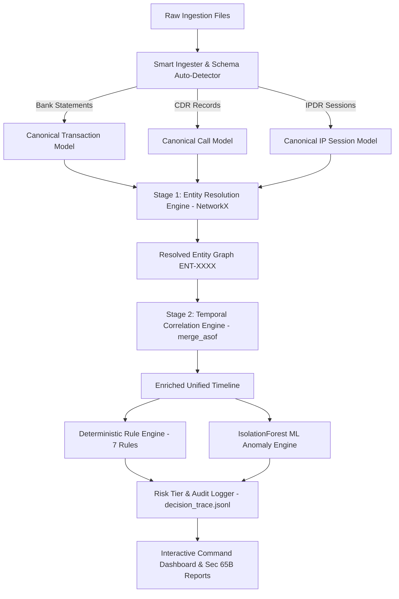

# 🏰 TOWER-1 (E-RAKSHAK)

> **AI-Powered Financial & Telecom Dataset Analyzer**  
> *Cross-Dataset Fusion & Anomaly Engine for Bank Statements, CDR, and IPDR Logs*

[](https://www.python.org/)
[](https://fastapi.tiangolo.com/)
[](LICENSE)
[]()

---

## 📌 Executive Summary

Financial cybercrime investigations require correlating massive, heterogeneous datasets across institutions. Bank statements, Call Detail Records (CDR), and Internet Protocol Detail Records (IPDR) arrive in distinct formats from different providers. The decisive evidence lies at their exact intersection—the moment a suspect was on a phone call, active from an IP address, and transferring funds.

**E-RAKSHAK** automates this fusion process for Law Enforcement Agencies (LEAs). It normalizes raw multi-format files onto a unified entity and timeline model, evaluates deterministic forensic rules, computes machine learning anomaly scores, and generates court-admissible Section 65B forensic reports.

---

## 📂 Repository Structure

Our clean, modular monolithic architecture ensures maintainability, scalability, and ease of deployment.

```text
📦 TOWER-1
 ┣ 📂 backend                 # Python/FastAPI Backend Engine
 ┃ ┣ 📂 correlation           # Temporal fusion & rules engine
 ┃ ┣ 📂 data                  # Raw data parsers, generators & uploads
 ┃ ┣ 📂 graph                 # NetworkX Entity Resolution graph builders
 ┃ ┣ 📂 ingestion             # Multi-format schema auto-detectors (Bank, CDR, IPDR)
 ┃ ┣ 📂 report                # Section 65B report generators (Word .docx)
 ┃ ┣ 📂 resolution            # Stage 1 Entity resolution logic
 ┃ ┣ 📂 scoring               # Risk Tier & ML anomaly (IsolationForest)
 ┃ ┣ 📂 tests                 # PyTest unit and integration suites
 ┃ ┣ 📂 verification          # Benchmarking and regression tools
 ┃ ┣ 📜 main.py               # FastAPI application entry point
 ┃ ┗ 📜 pipeline.py           # Core execution pipeline
 ┣ 📂 frontend                # CrimeOS Dashboard (Vanilla JS/HTML/CSS)
 ┃ ┣ 📂 assets                # Images, icons, backgrounds
 ┃ ┣ 📂 components            # Reusable UI components (JSX structure)
 ┃ ┣ 📜 index.html            # Application entry view
 ┃ ┣ 📜 dashboard.html        # Main investigation command center
 ┃ ┣ 📜 style.css             # High-contrast styling (Dark/Light mode)
 ┃ ┗ 📜 app.js                # Frontend logic & API integration
 ┣ 📜 README.md               # Project documentation (You are here)
 ┣ 📜 requirements.txt        # Python dependencies
 ┗ 📜 master_prompt.md        # Technical architecture docs & references
```

---

## ✨ Key Capabilities

| Capability | Description |
|---|---|
| 📥 **Multi-Format Ingestion** | Schema auto-detection & parsing for **SBI (XLSX)**, **HDFC (CSV)**, **ICICI (PDF)** statements, plus telecom **CDR** and **IPDR** exports. |
| 🔗 **Stage 1 Entity Resolution** | Graph-anchored identity resolution using `NetworkX` connected components to link phones, bank accounts, UPI IDs, IMEIs, and IPs per suspect. |
| ⏱️ **$O(N \log N)$ Temporal Fusion** | High-performance windowed correlation engine leveraging `pandas.merge_asof` to match transactions with nearest calls and IP sessions. |
| 🛡️ **7 Deterministic Forensic Rules** | Named, transparent rule checks (`STR-1`, `MUL-1`, `TCS-1`, `TCS-2`, `IDR-1`, `LOC-1`, `LAY-1`) returning row-level evidence references. |
| 🤖 **IsolationForest ML** | Secondary machine learning anomaly detection (`Scikit-learn`) running alongside rule-gated risk scoring. |
| 📄 **Sec 65B BSA Admissibility** | Every ingested file is digested with `hashlib` SHA-256 at ingest and re-verified on request, and forensic + FIU-IND STR packages are generated as Word `.docx` with legal certification footers. No PDF export — the `.docx` is the deliverable. |
| 🗺️ **Interactive Visualizations** | Money-flow and identity network graphs (`Vis.js`) with amount/time/location/rule filters, a unified per-entity evidentiary timeline (SVG, focus+context zoom), and a cell tower geo-location map (`Leaflet.js`) plotted from the same tower master the LOC-1 rule geolocates against. |
| 🎨 **CrimeOS Dashboard** | Modern investigation command center with high-contrast **Dark Mode** and **Light Mode**, `Cmd+K` command palette, and AI Copilot. |

---

## 🛠️ System Architecture



---

## 🔬 Deterministic Rule Engine

Unlike opaque "black-box" AI systems, E-RAKSHAK uses named, explainable forensic rules. Every flag links directly to source row references for defense in court:

1. **`MUL-1` (Mule Account Signature)**: No activity for 30 days, then a credit of **₹1,00,000 or more** (an absolute floor — a large-for-this-account salary credit is not a mule inflow), of which **≥80%** leaves within 6 hours. The explanation reports the amount actually retained; it does not assert a closing balance, because no balance column reaches the event schema.
2. **`TCS-1` (Temporal Coincidence)**: A transaction occurs while the entity has **both** an active phone call and an IP session within the $W$-minute correlation window.
3. **`TCS-2` (Pre-Transfer Call)**: A call placed 1–15 minutes before a transfer **to an account or VPA belonging to the party who was called**. The link is verified either by entity resolution (called number and payee resolve to the same entity) or because the payee VPA embeds the called number. Without a link it does not fire — a call and a transfer merely landing in the same window is ordinary behaviour.
4. **`STR-1` (Structuring / Smurfing)**: Multiple outgoing transfers clustered just below reporting thresholds (₹49,000–₹49,900) within 24–48 hours.
5. **`IDR-1` (Identity Fan-out)**: One identity spread across more identifiers than a single subscriber holds — a single IMEI operating 2+ mobile numbers (graded HIGH), 3+ distinct bank accounts, or 2+ IMEIs. Also catches a device/SIM swap on one number, graded by whether a transfer occurs near the change.
6. **`LOC-1` (Geo-Improbable Location)**: Two consecutive events whose cell-tower / IP-derived coordinates imply a travel speed above **200 km/h** — real Haversine distance over real elapsed time, not a comparison against the KYC city.
7. **`LAY-1` (Layering & Circular Flow)**: Funds passed through a chain of accounts within hours, each hop losing **3–20%** to a commission skim, above a **₹50,000** floor and bounded to 6 hops. A return to the originating account is detected and ranked above an open chain; when the chain does not close, the explanation says so instead of claiming a cycle.

---

## 📊 Measured Performance & Accuracy

Every figure below is recomputed by the pipeline on each run and printed by
`backend/verification/verify.py` — none is a slide constant.

| Metric | Value | How it is measured |
|---|---|---|
| Pipeline runtime | **~5.7s** for 2,404 events / 1,368 resolved entities | One process, `gc` between runs, stdout captured so print I/O is not timed |
| Recall | **100%** (5 of 5 planted typologies) | Detected = escalated to HIGH or CRITICAL |
| Precision | **62.5%** (5 TP / 3 FP) | Same HIGH-or-CRITICAL threshold on both sides |
| Specificity | **92.5%** (37 of 40 planted clean entities unflagged) | Denominator is the generator's clean cohort, not all 1,368 resolved entities |
| Rules firing | **7 of 7** | Asserted by a test that fails if any rule goes dead |
| PDF parsing | **207 of 208 rows**, the 1 loss reported with its cause | `parsed + skipped == total` asserted by test |
| Test suite | **57 passing** | `pytest backend/tests/` |

**On the 62.5% precision** — we report the strict number rather than the flattering
one. Two of the three false positives (`ENT_0007`, `ENT_0014`) sit on the detected
laundering chain: the data generator builds that chain as
`[guilty_entity] + random.sample(clean_pool, 3)` (`generate_all.py:421`), so it routes
laundered funds through three accounts it then labels clean. The engine follows the
money and is penalised for being correct. We publish 62.5% and explain it rather than
redefine the metric until it improves.

---

## 🚀 Quick Start Guide

### Prerequisites
- **Python 3.10+**
- `pip` package manager

### 1. Clone & Setup Repository
```bash
git clone https://github.com/Dubey404aasutosh/TOWER-1.git
cd TOWER-1
```

### 2. Install Dependencies
```bash
pip install -r requirements.txt
```

### 3. Launch Application
```bash
python backend/main.py
```

Open your browser and navigate to:
👉 **`http://127.0.0.1:8000`**

---

## 💻 Tech Stack

- **Backend**: Python 3.10+, FastAPI, Uvicorn
- **Data Engineering & Graph**: Pandas, NetworkX, OpenPyXL, pdfplumber
- **Machine Learning**: Scikit-Learn (IsolationForest)
- **Frontend**: Vanilla HTML5, CSS3 (CSS Variables for Dark/Light Mode), JavaScript ES6+
- **Visualizations**: Vis.js Network (money-flow + identity graphs), hand-rolled SVG (unified timeline), Leaflet.js (cell tower geo map), Matplotlib (charts embedded in the .docx reports)
- **Reporting**: python-docx (Word `.docx` Sec 65B forensic report + FIU-IND STR), with timeline and money-flow charts embedded as images

---

## 📜 Legal & Compliance

E-RAKSHAK is designed in compliance with the **Bharatiya Nagarik Suraksha Sanhita (BNSS)**, **Bharatiya Sakshya Adhiniyam (BSA Section 65B)**, and the MHA/I4C NCRP Layer 1→4 forensic investigation model.

---

## 📄 License
Distributed under the **MIT License**. See `LICENSE` for more information.